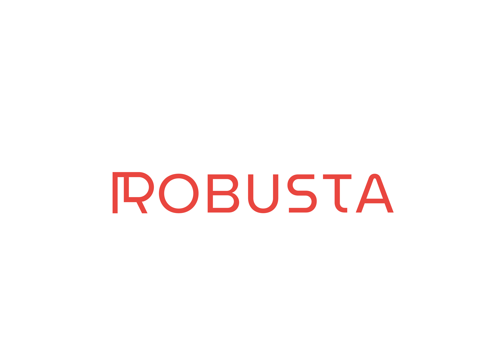

[

](https://robustastudio.com/)  

# Fleet Management System(Bus Management)

## Intro
This Repo is for Robusta Studio Hiring Task.
The task is buidling a fleet management system.

## Prerequisities

## Installation & Setup

## API Endpoints

All API Endpoints can be found with examples in this [Postman Collection](https://github.com/marwan-elgendy/Robusta-Bus-Fleet-Task/blob/master/Robusta%20Fleet%20Management.postman_collection.json)

### EED Diagram

